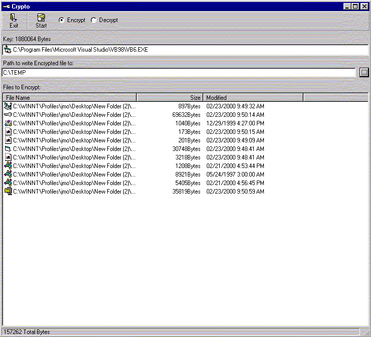



## Encryption using binary values from another file\!

### Description

UPDATED! This will Encrypt up to 255 different files of ANY type into ONE file using the binary values of an ENTIRE separate file as the KEY, while not altering the file being used as the key in any way!! The file names of the encrypted files are also stored in the encryption and restored when decrypted. Looks and works similar to WinZip. Just drag the files you wish to Encrypt\Decrypt from Explorer into the large list, and drag the file you wish to use as the key into the small box on top, select a path and thats it! The small icons of all the files you working with are also displayed in the list for readability.

The file being used as the key can be ANY type of file: .mp3, .bmp, .jpg, .txt, .exe, .zip, .dll or even another encrypted file. The file being used as the key can be ANY size. For maximum security, the file being used as the key should be slightly larger than the combined size of the files being encrypted and should have a limited amount repeating byte sequences. An example of a good key file would be an .mp3 or a large .zip file. This will make any effort at detecting a pattern more difficult and making the encryption harder to break.

Even if this program is de-compiled, there is no "magical" algorithm or encryption table to discover that would make decryption any easier, since the encryption relies completely on the binary values of a whole separate file.

No need to remember any long, complicated passwords or keys, JUST the name of ONE file!!!

Just don't lose the file being used as the key.

Created by: John O'Donald

14 Sovente

Irvine, CA 92606

(949)654-0065

john_odonald@hotmail.com.
 
### More Info
 
One file to be used as the key and between 1 and 255 other files to encrypt.

Knowledge of manipulating binary data.

One File encrypted or between 1 and 255 files decrypted.

             |
---                |---
**Submitted On**   |2000-02-23 09:50:16
**By**             |[John O'Donald](https://github.com/Planet-Source-Code/PSCIndex/blob/master/ByAuthor/john-o-donald.md)
**Level**          |Advanced
**User Rating**    |5.0 (30 globes from 6 users)
**Compatibility**  |VB 5\.0, VB 6\.0
**Category**       |[Encryption](https://github.com/Planet-Source-Code/PSCIndex/blob/master/ByCategory/encryption__1-48.md)
**World**          |[Visual Basic](https://github.com/Planet-Source-Code/PSCIndex/blob/master/ByWorld/visual-basic.md)
**Archive File**   |[CODE\_UPLOAD35682232000\.zip](https://github.com/Planet-Source-Code/john-o-donald-encryption-using-binary-values-from-another-file__1-5874/archive/master.zip)

### API Declarations

A Few.

